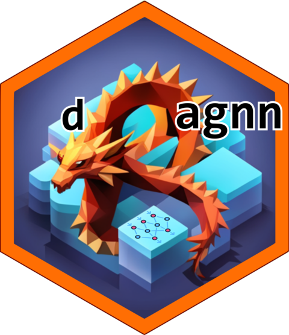

<!-- README.md is generated from README.Rmd. Please edit that file -->

```{r, include = FALSE}
knitr::opts_chunk$set(
  collapse = TRUE,
  comment = "#>",
  fig.path = "man/figures/README-",
  out.width = "100%"
)
```

# dagnn 

<!-- badges: start -->
[](https://github.com/rdinnager/dagnn/actions/workflows/R-CMD-check.yaml)
<!-- badges: end -->

The goal of dagnn is to provide a minimal package for quickly constructing neural network architectures with simple syntax. Essentially you specify a directed acyclic graph between neural network layers using a list of formulas, and `dagnn` constructs a full `torch::nn_module()` that can be used in downstream deep learning workflows.

## Installation

You can install the development version of dagnn from [GitHub](https://github.com/) with:

``` r
# install.packages("devtools")
devtools::install_github("rdinnager/dagnn")
```

## Example

Coming soon...

An *in-the-wild* example of using `dagnn` can be found here: https://github.com/rdinnager/bioclim_intrinsic_dimension

### About the logo
Logo generated using Stable Diffusion SDXL with editing by Russell Dinnage. 
Prompt: "An R package logo with a dragon in the shape of an R made of a neural network visualization, network graph, monochrome background"